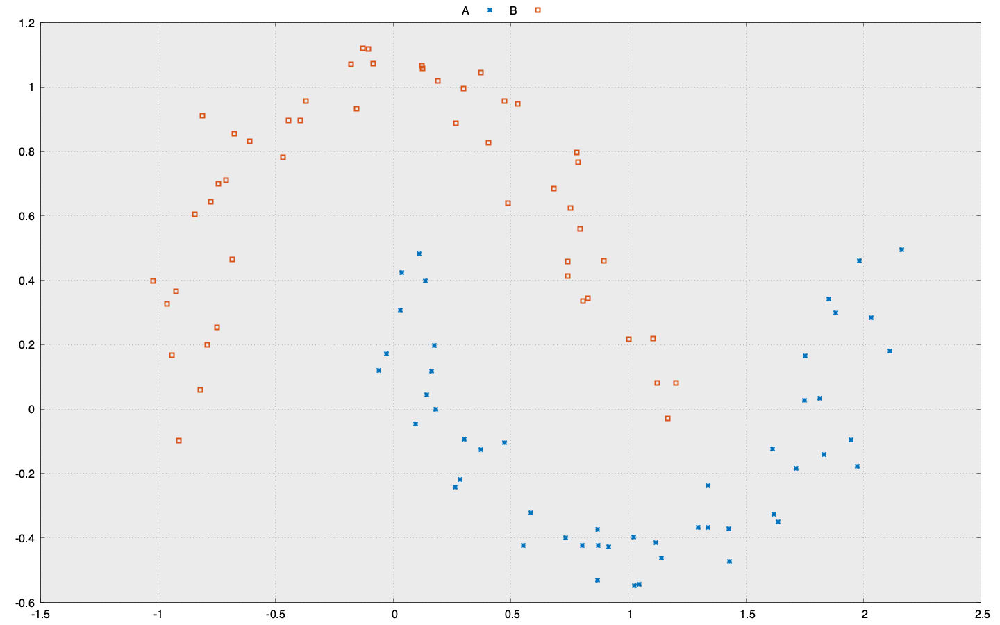

# SwiftMicrograd

An unapologetic mock-off of the awesome [micrograd](https://github.com/karpathy/micrograd) written in Swift.
This repo is mostly a learning exercise for me to get a deeper understanding of the inner works of neural networks. 
All credits go to the original author.

## Usage

```
USAGE: swift-micrograd-cli [<steps>] [<render-path>]

ARGUMENTS:
  <steps>                 Number of training steps (default: 100)
  <render-path>           Input data render path.

OPTIONS:
  -h, --help              Show help information.
```

## Run Tests

```
swift test
```

## Input Data

Input data is loaded from the `data.json` file



## License

MIT
